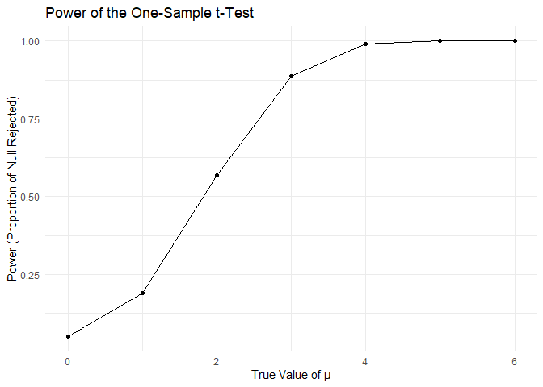
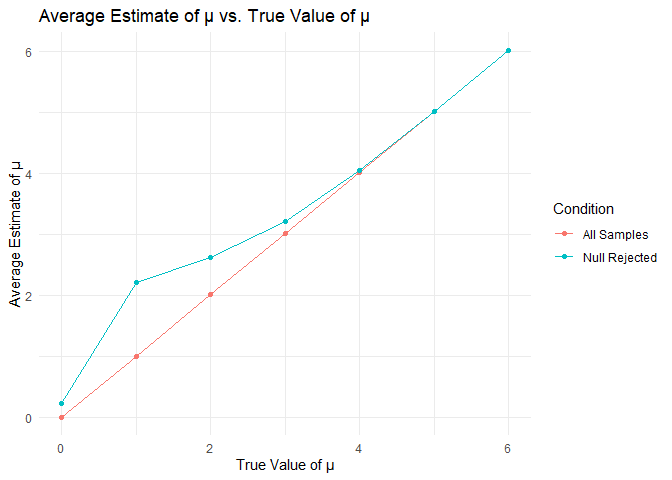
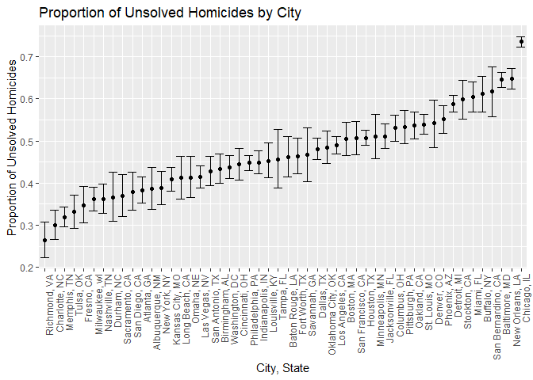

p8105_hw5_cj2793
================
Chenyu Jin
2024-11-02

``` r
library(tidyverse)
set.seed(1)
```

# Problem 2

## Set design parameters according to the problem

``` r
n <- 30
sigma <- 5
mu_values <- c(0:6)
iterations <- 5000
alpha <- 0.05
```

## Function to simulate data

``` r
simulate_t_test <- function(mu, sigma = 5, n = 30) {
  x <- rnorm(n, mean = mu, sd = sigma)
  t_test_result <- t.test(x, mu = 0)
  tibble(
    estimate = t_test_result[["estimate"]],
    p_value = t_test_result[["p.value"]]
  )
}
```

## Run simulation for each value of mu

``` r
simulation_results <- expand_grid(mu = mu_values, 
                                  iter = 1:iterations) |>
  mutate(
    result_df = map(mu, simulate_t_test)
  ) |>
  unnest(result_df)
```

## Calculate power for each mu value

``` r
power_results <- simulation_results |>
  group_by(mu) |>
  summarize(power = mean(p_value < alpha))
```

## Plot power vs. true value of mu

``` r
power_results |>
  ggplot(aes(x = mu, y = power)) +
  geom_line() +
  geom_point() +
  labs(
    title = "Power of the One-Sample t-Test",
    x = "True Value of μ",
    y = "Power (Proportion of Null Rejected)"
  ) +
  theme_minimal()
```

<!-- -->

The graph shows the relationship between the true value of μ and the
power of the one-sample t-test. As the true value of μ increases, the
power of the test also increases, indicating a higher probability of
rejecting the null hypothesis when the effect size is larger.

## Average estimate of mu across all samples and only when null is rejected

``` r
estimate_results <- simulation_results |>
  group_by(mu) |>
  summarize(
    avg_estimate_all = mean(estimate),
    avg_estimate_rejected = mean(estimate[p_value < alpha])
  )
```

## Plot average estimate vs. true value of mu

``` r
estimate_results |>
  ggplot(aes(x = mu)) +
  geom_line(aes(y = avg_estimate_all, color = "All Samples")) +
  geom_line(aes(y = avg_estimate_rejected, color = "Null Rejected")) +
  geom_point(aes(y = avg_estimate_all, color = "All Samples")) +
  geom_point(aes(y = avg_estimate_rejected, color = "Null Rejected")) +
  labs(
    title = "Average Estimate of μ vs. True Value of μ",
    x = "True Value of μ",
    y = "Average Estimate of μ",
    color = "Condition"
  ) +
  theme_minimal()
```

<!-- -->

The graph shows the average estimate of μ across all samples and only
for samples where the null hypothesis was rejected. The average estimate
of μ for rejected tests tends to be higher than the true value,
especially for smaller effect sizes, because only larger estimates pass
the significance value alpha = 0.05.

# Problem 3

## 0. Import raw data

``` r
homicide_df = read_csv(file = "data/homicide.csv", na = c("Unknown", "NA", "")) |>
  mutate(reported_date = as.Date(as.character(reported_date), format = "%Y%m%d"))
```

## 1. Describe the raw data

``` r
summary(homicide_df)
```

    ##      uid            reported_date        victim_last        victim_first      
    ##  Length:52179       Min.   :2007-01-01   Length:52179       Length:52179      
    ##  Class :character   1st Qu.:2010-03-18   Class :character   Class :character  
    ##  Mode  :character   Median :2012-12-16   Mode  :character   Mode  :character  
    ##                     Mean   :2012-11-02                                        
    ##                     3rd Qu.:2015-09-11                                        
    ##                     Max.   :2017-12-31                                        
    ##                                                                               
    ##  victim_race          victim_age     victim_sex            city          
    ##  Length:52179       Min.   :  0.0   Length:52179       Length:52179      
    ##  Class :character   1st Qu.: 22.0   Class :character   Class :character  
    ##  Mode  :character   Median : 28.0   Mode  :character   Mode  :character  
    ##                     Mean   : 31.8                                        
    ##                     3rd Qu.: 40.0                                        
    ##                     Max.   :102.0                                        
    ##                     NA's   :2999                                         
    ##     state                lat             lon          disposition       
    ##  Length:52179       Min.   :25.73   Min.   :-122.51   Length:52179      
    ##  Class :character   1st Qu.:33.77   1st Qu.: -96.00   Class :character  
    ##  Mode  :character   Median :38.52   Median : -87.71   Mode  :character  
    ##                     Mean   :37.03   Mean   : -91.47                     
    ##                     3rd Qu.:40.03   3rd Qu.: -81.76                     
    ##                     Max.   :45.05   Max.   : -71.01                     
    ##                     NA's   :60      NA's   :60

``` r
homicide_df <- homicide_df |>
  mutate(city_state = str_c(city, state, sep = ", "))

homicide_summary <- homicide_df |>
  group_by(city) |>
  summarize(
    total_homicides = n(),
    unsolved_homicides = sum(disposition %in% c("Closed without arrest", "Open/No arrest"),
                             na.rm = TRUE)
  )

homicide_summary |> knitr::kable()
```

| city           | total_homicides | unsolved_homicides |
|:---------------|----------------:|-------------------:|
| Albuquerque    |             378 |                146 |
| Atlanta        |             973 |                373 |
| Baltimore      |            2827 |               1825 |
| Baton Rouge    |             424 |                196 |
| Birmingham     |             800 |                347 |
| Boston         |             614 |                310 |
| Buffalo        |             521 |                319 |
| Charlotte      |             687 |                206 |
| Chicago        |            5535 |               4073 |
| Cincinnati     |             694 |                309 |
| Columbus       |            1084 |                575 |
| Dallas         |            1567 |                754 |
| Denver         |             312 |                169 |
| Detroit        |            2519 |               1482 |
| Durham         |             276 |                101 |
| Fort Worth     |             549 |                255 |
| Fresno         |             487 |                169 |
| Houston        |            2942 |               1493 |
| Indianapolis   |            1322 |                594 |
| Jacksonville   |            1168 |                597 |
| Kansas City    |            1190 |                486 |
| Las Vegas      |            1381 |                572 |
| Long Beach     |             378 |                156 |
| Los Angeles    |            2257 |               1106 |
| Louisville     |             576 |                261 |
| Memphis        |            1514 |                483 |
| Miami          |             744 |                450 |
| Milwaukee      |            1115 |                403 |
| Minneapolis    |             366 |                187 |
| Nashville      |             767 |                278 |
| New Orleans    |            1434 |                930 |
| New York       |             627 |                243 |
| Oakland        |             947 |                508 |
| Oklahoma City  |             672 |                326 |
| Omaha          |             409 |                169 |
| Philadelphia   |            3037 |               1360 |
| Phoenix        |             914 |                504 |
| Pittsburgh     |             631 |                337 |
| Richmond       |             429 |                113 |
| Sacramento     |             376 |                139 |
| San Antonio    |             833 |                357 |
| San Bernardino |             275 |                170 |
| San Diego      |             461 |                175 |
| San Francisco  |             663 |                336 |
| Savannah       |             246 |                115 |
| St. Louis      |            1677 |                905 |
| Stockton       |             444 |                266 |
| Tampa          |             208 |                 95 |
| Tulsa          |             584 |                193 |
| Washington     |            1345 |                589 |

The raw data consists of information on homicides across 50 large U.S.
cities, with 52179 records. The dataset contains variables such as
`reported_date`, `victim_last`, `victim_first`, `victim_race`,
`victim_age`, `victim_sex`, `city`, `state`, `lat`, `lon`, and
`disposition`. The reported_date ranges from 2007-01-01 to 2015-11-05,
and victim ages range from 0 to 102, with some missing values. The
disposition variable indicates the status of each case, with categories
like “Closed without arrest” and “Open/No arrest” representing unsolved
homicides.

## 2. `prop.test` for Baltimore, MD

``` r
baltimore_data <- homicide_summary |> 
  filter(city == "Baltimore")

baltimore_prop_test <- prop.test(baltimore_data[['unsolved_homicides']],
                                 baltimore_data[['total_homicides']]) |>
  broom::tidy()

baltimore_results <- baltimore_prop_test |> 
  select(estimate, conf.low, conf.high)

baltimore_results |> knitr::kable()
```

|  estimate |  conf.low | conf.high |
|----------:|----------:|----------:|
| 0.6455607 | 0.6275625 | 0.6631599 |

## 3. `prop.test` for each of the cities

### Define a function to estimate the proportion of unsolved homicides

``` r
estimate_unsolved_proportion <- function(unsolved, total) {
  prop_test_result <- prop.test(unsolved, total)
  broom::tidy(prop_test_result) |> 
    select(estimate, conf.low, conf.high)
}
```

### Apply the function to all cities

``` r
homicide_test_summary <- homicide_summary |>
  mutate(
    prop_test_result = map2(unsolved_homicides, total_homicides, 
                            \(x, y) estimate_unsolved_proportion(x, y))
  ) |>
  unnest(prop_test_result)

homicide_test_summary  |> knitr::kable()
```

| city           | total_homicides | unsolved_homicides |  estimate |  conf.low | conf.high |
|:---------------|----------------:|-------------------:|----------:|----------:|----------:|
| Albuquerque    |             378 |                146 | 0.3862434 | 0.3372604 | 0.4375766 |
| Atlanta        |             973 |                373 | 0.3833505 | 0.3528119 | 0.4148219 |
| Baltimore      |            2827 |               1825 | 0.6455607 | 0.6275625 | 0.6631599 |
| Baton Rouge    |             424 |                196 | 0.4622642 | 0.4141987 | 0.5110240 |
| Birmingham     |             800 |                347 | 0.4337500 | 0.3991889 | 0.4689557 |
| Boston         |             614 |                310 | 0.5048860 | 0.4646219 | 0.5450881 |
| Buffalo        |             521 |                319 | 0.6122841 | 0.5687990 | 0.6540879 |
| Charlotte      |             687 |                206 | 0.2998544 | 0.2660820 | 0.3358999 |
| Chicago        |            5535 |               4073 | 0.7358627 | 0.7239959 | 0.7473998 |
| Cincinnati     |             694 |                309 | 0.4452450 | 0.4079606 | 0.4831439 |
| Columbus       |            1084 |                575 | 0.5304428 | 0.5002167 | 0.5604506 |
| Dallas         |            1567 |                754 | 0.4811742 | 0.4561942 | 0.5062475 |
| Denver         |             312 |                169 | 0.5416667 | 0.4846098 | 0.5976807 |
| Detroit        |            2519 |               1482 | 0.5883287 | 0.5687903 | 0.6075953 |
| Durham         |             276 |                101 | 0.3659420 | 0.3095874 | 0.4260936 |
| Fort Worth     |             549 |                255 | 0.4644809 | 0.4222542 | 0.5072119 |
| Fresno         |             487 |                169 | 0.3470226 | 0.3051013 | 0.3913963 |
| Houston        |            2942 |               1493 | 0.5074779 | 0.4892447 | 0.5256914 |
| Indianapolis   |            1322 |                594 | 0.4493192 | 0.4223156 | 0.4766207 |
| Jacksonville   |            1168 |                597 | 0.5111301 | 0.4820460 | 0.5401402 |
| Kansas City    |            1190 |                486 | 0.4084034 | 0.3803996 | 0.4370054 |
| Las Vegas      |            1381 |                572 | 0.4141926 | 0.3881284 | 0.4407395 |
| Long Beach     |             378 |                156 | 0.4126984 | 0.3629026 | 0.4642973 |
| Los Angeles    |            2257 |               1106 | 0.4900310 | 0.4692208 | 0.5108754 |
| Louisville     |             576 |                261 | 0.4531250 | 0.4120609 | 0.4948235 |
| Memphis        |            1514 |                483 | 0.3190225 | 0.2957047 | 0.3432691 |
| Miami          |             744 |                450 | 0.6048387 | 0.5685783 | 0.6400015 |
| Milwaukee      |            1115 |                403 | 0.3614350 | 0.3333172 | 0.3905194 |
| Minneapolis    |             366 |                187 | 0.5109290 | 0.4585150 | 0.5631099 |
| Nashville      |             767 |                278 | 0.3624511 | 0.3285592 | 0.3977401 |
| New Orleans    |            1434 |                930 | 0.6485356 | 0.6231048 | 0.6731615 |
| New York       |             627 |                243 | 0.3875598 | 0.3494421 | 0.4270755 |
| Oakland        |             947 |                508 | 0.5364308 | 0.5040588 | 0.5685037 |
| Oklahoma City  |             672 |                326 | 0.4851190 | 0.4467861 | 0.5236245 |
| Omaha          |             409 |                169 | 0.4132029 | 0.3653146 | 0.4627477 |
| Philadelphia   |            3037 |               1360 | 0.4478103 | 0.4300380 | 0.4657157 |
| Phoenix        |             914 |                504 | 0.5514223 | 0.5184825 | 0.5839244 |
| Pittsburgh     |             631 |                337 | 0.5340729 | 0.4942706 | 0.5734545 |
| Richmond       |             429 |                113 | 0.2634033 | 0.2228571 | 0.3082658 |
| Sacramento     |             376 |                139 | 0.3696809 | 0.3211559 | 0.4209131 |
| San Antonio    |             833 |                357 | 0.4285714 | 0.3947772 | 0.4630331 |
| San Bernardino |             275 |                170 | 0.6181818 | 0.5576628 | 0.6753422 |
| San Diego      |             461 |                175 | 0.3796095 | 0.3354259 | 0.4258315 |
| San Francisco  |             663 |                336 | 0.5067873 | 0.4680516 | 0.5454433 |
| Savannah       |             246 |                115 | 0.4674797 | 0.4041252 | 0.5318665 |
| St. Louis      |            1677 |                905 | 0.5396541 | 0.5154369 | 0.5636879 |
| Stockton       |             444 |                266 | 0.5990991 | 0.5517145 | 0.6447418 |
| Tampa          |             208 |                 95 | 0.4567308 | 0.3881009 | 0.5269851 |
| Tulsa          |             584 |                193 | 0.3304795 | 0.2927201 | 0.3705039 |
| Washington     |            1345 |                589 | 0.4379182 | 0.4112495 | 0.4649455 |

``` r
homicide_test_summary <- homicide_test_summary |>
  arrange(desc(estimate))

homicide_test_summary |> 
  ggplot(aes(x = reorder(city, estimate), y = estimate)) +
  geom_point() +
  geom_errorbar(aes(ymin = conf.low, ymax = conf.high), width = 0.2) +
  coord_flip() +
  labs(
    title = "Proportion of Unsolved Homicides by City",
    x = "City",
    y = "Proportion of Unsolved Homicides"
  ) +
  theme_minimal()
```

<!-- -->
